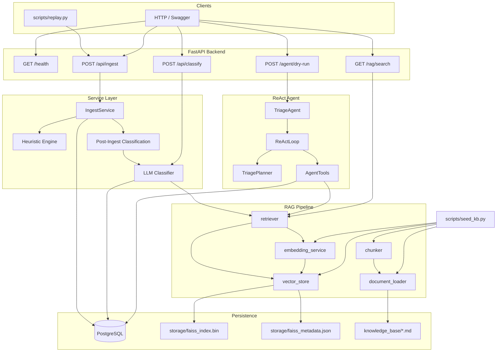
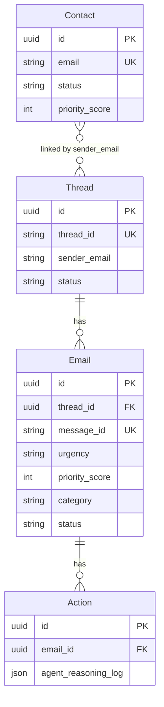

# AI CRM System

Production-grade, AI-powered Customer Relationship Management platform for autonomous email triage, agentic workflows, and real-time business insights.

**Assessment spec:** see [`project.md`](project.md)  
**Dataset:** [`email-data-advanced.json`](email-data-advanced.json) — 60 emails, 30+ threads

---

## Table of Contents

- [Architecture](#architecture)
- [Tech Stack](#tech-stack)
- [Project Structure](#project-structure)
- [Quick Start](#quick-start)
- [Configuration](#configuration)
- [Database](#database)
- [API Reference (Implemented)](#api-reference-implemented)
- [Email Ingestion Pipeline](#email-ingestion-pipeline)
- [Heuristic Triage Engine](#heuristic-triage-engine)
- [RAG Knowledge Pipeline](#rag-knowledge-pipeline)
- [LLM Classification (Layer 2)](#llm-classification-layer-2)
- [Autonomous Triage Agent (ReAct)](#autonomous-triage-agent-react)
- [Analytics API](#analytics-api)
- [Dashboard API](#dashboard-api)
- [Thread Workspace API](#thread-workspace-api)
- [Scripts](#scripts)
- [Knowledge Base](#knowledge-base)
- [Design Decisions](#design-decisions)
- [What's Not Built Yet](#whats-not-built-yet)
- [Continuing Development](#continuing-development)
- [Development Progress Log](#development-progress-log)

---

## Architecture



### Data model (implemented)



> **Note:** `Contact` model exists but is not yet populated during ingestion. `Action` records are written when the agent runs in non-dry-run mode.

---

## Tech Stack

| Layer | Technology |
|-------|------------|
| Runtime | Python 3.11+ |
| API | FastAPI, Uvicorn |
| ORM | SQLAlchemy 2.0 |
| Database | PostgreSQL |
| Migrations | Alembic |
| Config | Pydantic Settings, `.env` |
| Embeddings | sentence-transformers (`all-MiniLM-L6-v2`) |
| Vector store | FAISS (`IndexFlatL2`) |
| Chunking | langchain-text-splitters |
| HTTP client | httpx (replay simulator) |
| LLM | Google Gemini 2.5 Flash (`google-genai`) |

---

## Project Structure

```
Ai_crm_system/
├── alembic/                    # DB migrations
├── app/
│   ├── agents/
│   │   ├── triage_agent.py     # ReAct entry point
│   │   ├── react_loop.py       # Thought → Action → Observation loop
│   │   ├── planner.py          # Workflow routing + next-step selection
│   │   ├── churn_detection.py  # Churn-risk trigger detection
│   │   ├── agent_state.py      # Mutable agent state between steps
│   │   ├── tools.py            # AgentTools (RAG, CRM, tickets, drafts)
│   │   └── reasoning.py        # ReasoningStep, AgentResult schemas
│   ├── api/
│   │   ├── agent.py            # POST /agent/dry-run/{email_id}
│   │   ├── analytics.py        # GET /analytics/*
│   │   ├── dashboard.py        # GET /dashboard/stats
│   │   ├── threads.py          # GET /threads/{thread_id}/workspace
│   │   ├── agent_errors.py     # Agent HTTP error mapping
│   │   ├── classification.py   # POST /api/classify/{email_id}
│   │   ├── deps.py             # FastAPI dependencies (DB session, services)
│   │   ├── rag.py              # GET /rag/search
│   │   ├── router.py           # POST /api/ingest
│   │   └── test.py             # POST /test/classify/{email_id}
│   ├── core/
│   │   └── config.py           # Pydantic settings
│   ├── db/
│   │   └── database.py         # Engine, SessionLocal, get_db
│   ├── models/                 # SQLAlchemy ORM models
│   │   ├── contact.py
│   │   ├── thread.py
│   │   ├── email.py
│   │   ├── action.py
│   │   └── enums.py
│   ├── rag/
│   │   ├── document_loader.py  # Load knowledge_base/*.md
│   │   ├── chunker.py          # RecursiveCharacterTextSplitter
│   │   ├── embedding_service.py
│   │   ├── vector_store.py     # FAISS persistence
│   │   └── retriever.py        # Query → top-3 chunks
│   ├── schemas/                # Pydantic request/response models
│   │   ├── email.py
│   │   ├── classification.py
│   │   ├── agent.py
│   │   ├── analytics.py
│   │   └── rag.py
│   ├── scripts/
│   │   ├── replay.py           # Email replay simulator
│   │   └── seed_kb.py          # Build FAISS index
│   ├── services/
│   │   ├── heuristics.py       # Layer 1 triage (no LLM)
│   │   ├── ingest_service.py
│   │   ├── post_ingest.py      # Background classification on ingest
│   │   ├── classification_service.py
│   │   ├── analytics_service.py    # Chart metrics
│   │   ├── dashboard_service.py    # Mission control KPIs
│   │   ├── thread_workspace_service.py  # Thread workspace payload
│   │   ├── thread_context_service.py  # LLM-ready thread history
│   │   ├── llm_classifier.py   # Gemini Layer 2 classification
│   │   └── exceptions.py
│   └── main.py                 # FastAPI app entry point
├── knowledge_base/             # Enterprise policy documents (6 files)
├── scripts/                    # CLI entry points (thin wrappers)
│   ├── replay.py
│   ├── seed_kb.py
│   ├── test_bob_jones.py       # Bob Jones SLA/legal workflow test
│   └── test_churn_risk.py      # Churn-risk retention workflow test
├── storage/                    # Generated at runtime (gitignore recommended)
│   ├── faiss_index.bin
│   └── faiss_metadata.json
├── email-data-advanced.json
├── requirements.txt
├── alembic.ini
├── .env.example
└── project.md                  # Full assessment requirements
```

---

## Quick Start

### 1. Prerequisites

- Python 3.11+
- PostgreSQL running locally
- ~2 GB disk for `torch` + embedding model (first run downloads from Hugging Face)

### 2. Install

```powershell
cd Ai_crm_system
python -m venv .venv
.venv\Scripts\Activate.ps1
pip install -r requirements.txt
```

### 3. Configure environment

```powershell
copy .env.example .env
# Edit .env with your PostgreSQL credentials
```

### 4. Database setup

```powershell
# Create database (psql or pgAdmin)
# CREATE DATABASE crm_agent;

alembic upgrade head
```

### 5. Seed knowledge base (required for RAG)

```powershell
python scripts/seed_kb.py
```

### 6. Start API

```powershell
uvicorn app.main:app --reload --port 8000
```

Swagger UI: http://localhost:8000/docs

### 7. Replay test emails (optional)

```powershell
# In another terminal, with API running
python scripts/replay.py --speed 1
```

---

## Configuration

Environment variables (see [`.env.example`](.env.example)):

| Variable | Default | Description |
|----------|---------|-------------|
| `POSTGRES_USER` | `postgres` | DB user |
| `POSTGRES_PASSWORD` | `postgres` | DB password |
| `POSTGRES_HOST` | `localhost` | DB host |
| `POSTGRES_PORT` | `5432` | DB port |
| `POSTGRES_DB` | `ai_crm` | DB name |
| `DATABASE_URL` | — | Optional override for full connection string |
| `ENVIRONMENT` | `development` | `development` / `staging` / `production` |
| `DEBUG` | `false` | FastAPI debug mode |
| `GEMINI_API_KEY` | — | Google Gemini API key (required for LLM classifier) |
| `GEMINI_MODEL` | `gemini-2.5-flash` | Gemini model ID |
| `CLASSIFICATION_RAG_TOP_K` | `1` | RAG chunks sent to classifier (was 3) |
| `CLASSIFICATION_MAX_THREAD_MESSAGES` | `2` | Prior thread messages in prompt |
| `CLASSIFICATION_MAX_THREAD_BODY_CHARS` | `400` | Max chars per prior message body |
| `CLASSIFICATION_MAX_EMAIL_BODY_CHARS` | `1500` | Max chars for current email body |
| `CLASSIFICATION_MAX_RAG_CHUNK_CHARS` | `350` | Max chars per RAG chunk |
| `CLASSIFICATION_MAX_OUTPUT_TOKENS` | `1024` | Max Gemini output tokens (classifier + drafts) |

---

## Database

### Models

| Table | Purpose |
|-------|---------|
| `contacts` | CRM contact profiles (VIP, churn risk, account value) |
| `threads` | Conversation threads (external `thread_id` from dataset) |
| `emails` | Individual messages with triage fields |
| `actions` | Agent actions and full ReAct reasoning logs (`agent_reasoning_log` JSON) |

### Migrations

| Revision | Description |
|----------|-------------|
| `bd19c5174ec7` | Core tables: contacts, threads, emails, actions |
| `bc35f2ecace3` | Empty placeholder migration |
| `4a4ebbc056da` | Add `emails.priority_score` column + index |

```powershell
alembic revision --autogenerate -m "describe change"
alembic upgrade head
```

Models auto-register via `app/models/__init__.py` → `load_models()`.

---

## API Reference (Implemented)

| Method | Endpoint | Status | Description |
|--------|----------|--------|-------------|
| `GET` | `/health` | ✅ | Liveness + DB connectivity check |
| `POST` | `/api/ingest` | ✅ | Ingest email with heuristic triage |
| `GET` | `/rag/search?q=` | ✅ | Search knowledge base, top 3 chunks |
| `POST` | `/api/classify/{email_id}` | ✅ | Classification pipeline — classify + save to DB |
| `POST` | `/test/classify/{email_id}` | ✅ | Classify only (test, no DB write) |
| `POST` | `/agent/dry-run/{email_id}` | ✅ | ReAct agent dry-run (reasoning trace, no DB writes) |
| `GET` | `/analytics/category-breakdown` | ✅ | Email counts by `category` |
| `GET` | `/analytics/sentiment-trend` | ✅ | Daily average `sentiment_score` |
| `GET` | `/analytics/escalation-rate` | ✅ | Escalation share (`requires_human`, status, actions) |
| `GET` | `/analytics/action-distribution` | ✅ | Agent `action_type` counts |
| `GET` | `/analytics/confidence-distribution` | ✅ | Confidence buckets (high/medium/low) |
| `GET` | `/dashboard/stats` | ✅ | Mission control KPI summary |
| `GET` | `/dashboard/inbox` | ✅ | Paginated inbox feed (newest first) |
| `GET` | `/dashboard/agent-activity` | ✅ | Recent agent actions (limit 50) |
| `GET` | `/threads/{thread_id}/workspace` | ✅ | Thread view (emails, classification, actions, trace) |

### `POST /api/ingest`

**Request:**
```json
{
  "message_id": "msg_001",
  "thread_id": "thread_alice_pricing",
  "sender": "alice.smith@greenlight-npo.org",
  "subject": "Question about pricing",
  "body": "Do you offer nonprofit discounts?",
  "timestamp": "2023-10-01T09:00:00Z"
}
```

**Response `202`:**
```json
{ "job_id": "<email-uuid>", "status": "accepted" }
```

**Errors:**
- `409` — duplicate `message_id`
- `422` — validation (empty subject/body, missing fields)

### `GET /rag/search?q=refund`

**Response `200`:**
```json
[
  {
    "source_doc": "refund_policy.md",
    "similarity_score": 0.52,
    "chunk_text": "..."
  }
]
```

**Errors:**
- `503` — FAISS index not built (run `seed_kb.py`)
- `422` — empty query

### `POST /agent/dry-run/{email_id}`

**Prerequisite:** Email must already be classified — `category`, `urgency`, and `confidence` must be set. Run `POST /api/classify/{email_id}` first (or wait for background classification after ingest).

**Response `200`:**
```json
{
  "final_action": "escalate_to_human",
  "reasoning_trace": [
    {
      "thought": "Load the target email before starting the ReAct loop.",
      "action": "load_email(<uuid>)",
      "observation": "sender=..., subject=..., status=Received"
    },
    {
      "thought": "SLA/legal trigger — retrieve full thread history before acting.",
      "action": "get_thread_history(thread_bob_outage)",
      "observation": "Retrieved 1106 characters across thread thread_bob_outage."
    }
  ]
}
```

**Final actions:** `escalate_to_human`, `ignore`, `create_internal_ticket`, `draft_reply`, `retention_draft_response`

**Errors:**
- `422` `TRIAGE_NOT_READY` — email not classified yet
- `404` `EMAIL_NOT_FOUND`
- `502` `DRAFT_REPLY_FAILED` — Gemini draft generation failed
- `503` `RAG_INDEX_NOT_FOUND` — run `seed_kb.py`

### Error envelope (implemented endpoints)

```json
{
  "detail": {
    "error_code": "DUPLICATE_MESSAGE_ID",
    "message": "Human-readable message",
    "details": {}
  }
}
```

---

## Email Ingestion Pipeline

**Flow:** validate → heuristic triage → store email → return `job_id` → background classification

```
POST /api/ingest
  → Duplicate check (message_id)
  → triage_email(sender, subject, body)          # Layer 1
  → Find or create Thread by thread_id string
  → Create Email record + commit
  → Return { job_id: email.id, status: "accepted" }  # immediate 202
  → BackgroundTasks: run_post_ingest_classification(job_id)
       → Skip if spam / internal / Ignored
       → Set status Processing
       → RAG + Gemini classification              # Layer 2
       → Save category, urgency, confidence, requires_human, sentiment_score
       → Set status Received (preserves Escalated / Ignored)
```

**Files:**
- `app/api/router.py` — route handler
- `app/services/ingest_service.py` — business logic
- `app/schemas/email.py` — `EmailIn`, `EmailResponse`

**Validation rules:**
- All fields required
- Empty `subject` rejected
- Empty or whitespace-only `body` rejected
- Duplicate `message_id` → `409`

**Thread linking:**
- `Thread.thread_id` = external ID from dataset (e.g. `thread_alice_pricing`)
- `Email.thread_id` = FK to `Thread.id` (UUID)
- `last_updated_at` updated when newer email arrives

---

## Heuristic Triage Engine

**File:** `app/services/heuristics.py`  
**Runs synchronously on ingest — no LLM calls.**

### Detection rules

| Signal | Keywords / rules |
|--------|------------------|
| Spam | `nigerian prince`, `seo services`, `earn money fast` |
| Security | `suspicious login`, `breach`, `ransomware` |
| Internal | Sender domain `internal.com` or `mycompany.com` |
| Critical urgency | `p0`, `ransomware`, `cease and desist`, `breach`, `suspicious login` |
| High urgency | `urgent`, `legal` |

### Priority scores (stored in `Email.priority_score`)

| Signal | Score |
|--------|-------|
| Ransomware | 100 |
| P0 | 80 |
| Security (non-ransomware) | 80 |
| Legal / cease and desist | 50 |
| Urgent | 30 |
| Refund | 10 |
| Spam | 5 |
| Default | 0 |

### Ingest side-effects

| Condition | `category` | `status` | `urgency` |
|-----------|------------|----------|-----------|
| Spam | `Spam` | `Ignored` | from heuristic |
| Security | — | `Escalated` | `Critical` |
| Default | — | `Received` | from heuristic |

---

## RAG Knowledge Pipeline

### Components

| Module | Role |
|--------|------|
| `document_loader.py` | Load 6 markdown files from `knowledge_base/` |
| `chunker.py` | Split into 500-char chunks, 50-char overlap |
| `embedding_service.py` | `all-MiniLM-L6-v2`, L2-normalized, singleton |
| `vector_store.py` | FAISS `IndexFlatL2`, persist to `storage/` |
| `retriever.py` | Embed query → search → top 3 chunks |

### Build index

```powershell
python scripts/seed_kb.py
```

Output: 136 chunks across 6 documents → `storage/faiss_index.bin` + `storage/faiss_metadata.json`

### Programmatic usage

```python
from app.rag.retriever import retrieve

chunks = retrieve("I want a refund")
# [{"source_doc": "refund_policy.md", "chunk_text": "...", "similarity_score": 0.52}, ...]
```

### RAG design notes

- **Chunk size:** 500 characters (not tokens) — aligns with project 300–500 token target approximately
- **Index type:** `IndexFlatL2` on L2-normalized vectors; similarity derived as `1 - distance/2`
- **Model:** Local `all-MiniLM-L6-v2` (384-dim) — no API cost, runs on CPU
- **Wired into classification** — `LLMClassifier` retrieves RAG chunks per email
- **Wired into agent** — `AgentTools.search_knowledge_base()` used during ReAct loop

---

## LLM Classification (Layer 2)

**Files:** `app/services/llm_classifier.py`, `app/services/classification_service.py`, `app/schemas/classification.py`

**Flow:**
```
POST /api/classify/{email_id}
  → Load email + thread context
  → RAG retrieve (top-k configurable)
  → Gemini JSON classification
  → Validate ClassificationResult (retry once on failure)
  → Save category, urgency, confidence, requires_human, sentiment_score
```

**Background on ingest:** `POST /api/ingest` queues `run_post_ingest_classification()` via `BackgroundTasks`. Skips spam, internal, and `Ignored` emails.

**Prompt size limits** (configurable via `.env`):

| Setting | Default |
|---------|---------|
| `CLASSIFICATION_RAG_TOP_K` | 1 |
| `CLASSIFICATION_MAX_THREAD_MESSAGES` | 2 |
| `CLASSIFICATION_MAX_THREAD_BODY_CHARS` | 400 |
| `CLASSIFICATION_MAX_EMAIL_BODY_CHARS` | 1500 |
| `CLASSIFICATION_MAX_RAG_CHUNK_CHARS` | 350 |
| `CLASSIFICATION_MAX_OUTPUT_TOKENS` | 1024 |

---

## Autonomous Triage Agent (ReAct)

**Files:** `app/agents/` — `triage_agent.py`, `react_loop.py`, `planner.py`, `agent_state.py`, `tools.py`, `reasoning.py`

### Execution model

```
load_email + load_classification  (setup)
        ↓
┌──────────────────────────────────────┐
│  ReAct loop (max 6 tool calls):      │
│    Thought  ← TriagePlanner.plan()   │
│    Action   ← tool or final action   │
│    Observation ← tool result           │
└──────────────────────────────────────┘
        ↓
final_action → stop (+ persist trace when not dry-run)
```

Each step is stored as `{ thought, action, observation }` in `reasoning_trace` and `actions.agent_reasoning_log`.

### Agent tools

| Tool | Description |
|------|-------------|
| `search_knowledge_base(query)` | RAG search across internal docs |
| `get_thread_history(thread_id)` | Chronological thread context |
| `get_contact_profile(email)` | CRM profile (VIP, churn risk, account value) |
| `check_account_status(email)` | Billing tier, renewal status, overdue invoices |
| `flag_for_legal(email_id, issue_type)` | Mark email for legal review |
| `create_internal_ticket(title, body, assignee)` | Mock internal ticket |
| `draft_reply(context)` | Gemini customer reply |
| `draft_holding_reply(context)` | Empathetic holding reply (no binding commitments) |
| `create_retention_ticket(title, body, customer_email)` | Open retention-team ticket (`RET-*`) |
| `escalate_to_account_manager(email_id, reason, customer_email)` | Route to assigned account manager |
| `draft_retention_reply(context)` | Retention-focused de-escalation reply |
| `escalate_to_human(email_id, reason, priority)` | Queue human escalation with brief |

### Planner workflows

| Workflow | Trigger | Steps |
|----------|---------|-------|
| `bob_jones` | SLA/legal keywords in subject/body | 6 tools → `escalate_to_human` |
| `churn_risk` | Refund demand, review threat, cancellation, or 3 negative interactions | 4 tools → `retention_draft_response` |
| `immediate_escalate` | Low confidence, `requires_human`, Critical, Complaint+High | → `escalate_to_human` |
| `immediate_ignore` | `category == Spam` | → `ignore` |
| `compliance` | `category == Compliance` | `get_thread_history` → `create_internal_ticket` |
| `legal` | `category == Legal` | `flag_for_legal` → `escalate_to_human` |
| `default` | All other classified emails | `get_thread_history` → `search_knowledge_base` → `draft_reply` |

### Churn-risk retention workflow (msg_033 / Karen)

**Triggers** (any one activates the workflow):

| Trigger | Detection |
|---------|-----------|
| Refund demand | Keywords: `refund`, `money back`, `full refund` |
| Review threat | Keywords: `g2`, `trustpilot`, `capterra`, `public review`, `negative review`, `post on twitter` |
| Cancellation request | Keywords: `cancel`, `cancellation`, `delete my account`, `unsubscribe` |
| 3 consecutive negative interactions | Last 3 inbound emails from sender in thread have `sentiment_score < -0.15` or negative keywords |

**Tool sequence (4 calls, then final draft):**
1. `get_thread_history`
2. `search_knowledge_base("refund retention")`
3. `create_retention_ticket` → `retention@flowstack.io`
4. `escalate_to_account_manager` → assigned AM (e.g. `mike.torres@flowstack.io` for retail)
5. **Final:** `retention_draft_response` via `draft_retention_reply`

**Test:**
```powershell
$env:PYTHONPATH="."
python scripts/test_churn_risk.py
```

### Bob Jones escalation workflow (msg_060)

**Triggers** (case-insensitive, in subject or body): `sla breach`, `legal review`, `attorney`, `breach of contract`

**Tool sequence (6 calls, then escalate):**
1. `get_thread_history`
2. `search_knowledge_base("SLA")`
3. `check_account_status` — Bob returns Enterprise tier, renewal `on_hold`
4. `flag_for_legal`
5. `create_internal_ticket` → `legal@flowstack.io`
6. `draft_holding_reply`
7. **Final:** `escalate_to_human`

**Test:**
```powershell
$env:PYTHONPATH="."
python scripts/test_bob_jones.py
```

### Triage rules (enforced by planner)

- `confidence < 0.7` → escalate
- `requires_human == True` → escalate
- `urgency == Critical` → escalate (no auto-reply)
- `category == Spam` → ignore
- Bob Jones workflow takes priority when SLA/legal keywords match
- Churn-risk workflow takes priority over generic escalation when churn triggers match

---

## Analytics API

**Files:** `app/services/analytics_service.py`, `app/api/analytics.py`, `app/schemas/analytics.py`

Chart-ready JSON endpoints for dashboard widgets.

### `GET /analytics/category-breakdown`

```json
{
  "Complaint": 25,
  "Inquiry": 12,
  "Compliance": 4,
  "Spam": 7,
  "Legal": 2
}
```

Counts classified emails by `Email.category` (null categories excluded).

### `GET /analytics/sentiment-trend`

```json
[
  { "date": "2026-06-10", "avg_sentiment": -0.4 }
]
```

Groups by calendar day from `Email.timestamp`; averages `Email.sentiment_score`.

### `GET /analytics/escalation-rate`

```json
{
  "total_emails": 100,
  "escalated": 18,
  "rate": 18.0
}
```

Escalated = distinct emails where `requires_human=True`, `status=Escalated`, or an `escalate_to_human` action exists. `rate` is percentage rounded to 1 decimal.

### `GET /analytics/action-distribution`

```json
{
  "draft_reply": 40,
  "escalate_to_human": 18,
  "ignore": 12,
  "create_ticket": 10
}
```

Counts from `actions.action_type`. `create_internal_ticket` / `create_retention_ticket` roll up to `create_ticket`; `retention_draft_response` rolls up to `draft_reply`.

### `GET /analytics/confidence-distribution`

```json
{
  "high": 60,
  "medium": 25,
  "low": 15
}
```

Buckets from `Email.confidence`: high ≥ 0.8, medium ≥ 0.6, low < 0.6.

---

## Dashboard API

**Files:** `app/services/dashboard_service.py`, `app/api/dashboard.py`, `app/schemas/dashboard.py`

### `GET /dashboard/stats`

```json
{
  "total_emails": 72,
  "total_threads": 59,
  "critical_cases": 9,
  "escalations": 9,
  "spam_detected": 2,
  "avg_confidence": 0.965,
  "open_threads": 59,
  "resolved_threads": 0
}
```

| Field | Source |
|-------|--------|
| `total_emails` | Count of all `emails` rows |
| `total_threads` | Count of all `threads` rows |
| `critical_cases` | Emails with `urgency == Critical` |
| `escalations` | Distinct emails with `requires_human`, `status=Escalated`, or `escalate_to_human` action |
| `spam_detected` | Emails with `category == Spam` |
| `avg_confidence` | Mean `confidence` over classified emails (0.0 if none) |
| `open_threads` | Threads with `status == Open` |
| `resolved_threads` | Threads with `status == Resolved` |

### `GET /dashboard/inbox`

Query params: `limit` (default 50, max 200), `offset` (default 0). Sorted by `timestamp` descending.

```json
[
  {
    "email_id": "8a95ff42-6ba4-4471-b206-13940c4d106a",
    "sender": "karen.w@retail-co.com",
    "subject": "Final Warning Before Public Review",
    "category": "Complaint",
    "urgency": "High",
    "status": "Received",
    "confidence": 0.92,
    "timestamp": "2023-10-16T14:30:00+00:00"
  }
]
```

Unclassified fields return `""` for strings and `null` for `confidence`.

### `GET /dashboard/agent-activity`

Query param: `limit` (default 50, max 200). Returns recent rows from `actions`, newest `executed_at` first.

```json
[
  {
    "action_type": "escalate_to_human",
    "email_id": "34b5ba5a-f6ba-417c-8fab-ad2f09bc3dac",
    "timestamp": "2026-06-11T10:15:00+00:00",
    "reason": "SLA breach + legal review escalation"
  }
]
```

`reason` is parsed from the agent reasoning log (`reason='...'` in escalation steps); falls back to the final thought or action-type label.

---

## Thread Workspace API

**Files:** `app/services/thread_workspace_service.py`, `app/api/threads.py`, `app/schemas/thread.py`

Single endpoint for the frontend thread workspace. `thread_id` is the external dataset ID (e.g. `thread_karen_refund`).

### `GET /threads/{thread_id}/workspace`

```json
{
  "thread": [
    {
      "email_id": "...",
      "message_id": "msg_006",
      "sender": "karen.w@retail-co.com",
      "subject": "Refund Request - Order #88271",
      "body": "...",
      "timestamp": "2023-10-01T09:00:00+00:00",
      "status": "Received",
      "category": "Complaint",
      "urgency": "High",
      "confidence": 0.92
    }
  ],
  "classification": {
    "email_id": "...",
    "category": "Complaint",
    "urgency": "High",
    "confidence": 0.92,
    "requires_human": true,
    "sentiment_score": -0.8
  },
  "agent_actions": [
    {
      "action_id": "...",
      "action_type": "escalate_to_human",
      "email_id": "...",
      "timestamp": "2026-06-11T10:15:00+00:00",
      "proposed_content": "..."
    }
  ],
  "reasoning_trace": [
    {
      "thought": "SLA/legal trigger — retrieve full thread history before acting.",
      "action": "get_thread_history(thread_bob_outage)",
      "observation": "Retrieved 1106 characters..."
    }
  ]
}
```

| Section | Source |
|---------|--------|
| `thread` | All emails in thread, chronological |
| `classification` | Latest classified email in thread (`null` if none) |
| `agent_actions` | All `actions` for thread emails, newest first |
| `reasoning_trace` | `agent_reasoning_log` from the most recent action |

**Errors:** `404 THREAD_NOT_FOUND`

---

## Scripts

| Script | Command | Purpose |
|--------|---------|---------|
| Replay simulator | `python scripts/replay.py --speed 1` | POST all 60 dataset emails to `/api/ingest` |
| KB seeder | `python scripts/seed_kb.py` | Build FAISS index from knowledge base |
| Bob Jones test | `python scripts/test_bob_jones.py` | Verify SLA/legal ReAct workflow on msg_060 |
| Churn-risk test | `python scripts/test_churn_risk.py` | Verify retention workflow on msg_033 |

**Replay options:**
```powershell
python scripts/replay.py --speed 0          # max speed
python scripts/replay.py --base-url http://localhost:8001
python scripts/replay.py --data-file email-data-advanced.json
```

---

## Knowledge Base

Fictional enterprise SaaS: **FlowStack**

| File | Contents |
|------|----------|
| `pricing_policy.md` | Tiers, 30% nonprofit discount, pro-rata billing |
| `sla_policy.md` | 99.9% uptime, P0 response times, credit formula, 24h RCA |
| `refund_policy.md` | 14-day window, credits vs refunds, retention playbook |
| `api_docs.md` | Rate limits, v1 deprecation, v2 breaking changes |
| `compliance_faq.md` | HIPAA BAA, GDPR DPA, SOC 2, data residency |
| `escalation_matrix.md` | Legal, security, PR crisis, GDPR, VIP routing |

---

## Design Decisions

| Decision | Rationale |
|----------|-----------|
| Sync SQLAlchemy (not async) | Simpler Alembic integration; DB is bottleneck not CPU for current scale |
| `job_id` = email UUID | Reuses existing PK; `GET /api/status/{job_id}` can query email directly |
| Heuristics before DB write | Sub-10ms triage per spec; avoids storing then re-processing |
| FAISS on disk (not pgvector) | Zero extra infra; sufficient for 136 chunks; portable index file |
| Local embeddings | No OpenAI dependency for RAG; assessment allows any embedding model |
| `Thread.thread_id` vs `Thread.id` | External string ID from dataset vs internal UUID FK — avoids string FKs |
| Spam checked before security | Prevents spam content from triggering security escalation |
| Rule-based ReAct planner | Deterministic Thought/Action/Observation trace for demo reliability; LLM used only for draft tools |
| Max 6 agent tool calls | Per `project.md`; final action runs after tool budget; overflow forces escalation |
| Classify before agent | Agent routes on `category`/`urgency`/`confidence`; background ingest classification is async |

---

## What's Not Built Yet

From [`project.md`](project.md) — prioritized for next work:

### Backend API (not implemented)

- [ ] `GET /api/status/{job_id}`
- [ ] `POST /respond/{email_id}`
- [ ] `PATCH /drafts/{id}`, `POST /drafts/{id}/approve`
- [ ] `GET /intelligence/reputation`
- [ ] `GET /audit/{entity_type}/{entity_id}`
- [ ] `GET /contacts/{email}`, `PATCH /contacts/{email}/status`

### Intelligence layers (not implemented)

- [ ] **Layer 3 — Sentiment trend tracking**
- [ ] **Live web intelligence** (scraping G2/Trustpilot, etc.)
- [ ] **LLM-driven planner** (current planner is rule-based ReAct, not Gemini CoT)
- [ ] **Agent tools not yet used:** `get_contact_profile`, `send_auto_reply`, `scrape_public_sentiment`

### Data / infra (not implemented)

- [ ] `knowledge_chunks` DB table (vectors currently file-based only)
- [ ] `web_intelligence_cache` table
- [ ] `audit_log` table
- [ ] Contact auto-creation on ingest
- [ ] Background job queue for async processing

### Frontend (not implemented)

- [ ] Mission Control Inbox
- [ ] Thread Workspace
- [ ] Analytics Dashboard

### Deliverables (not implemented)

- [ ] Architecture diagram (in README — mermaid above is a start)
- [ ] Screen recording
- [ ] ER diagram image

---

## Continuing Development

### Recommended next steps

1. **`GET /api/status/{job_id}`** — poll ingest + classification + agent state
2. **Contact upsert on ingest** — create/update `Contact` from sender email; wire `get_contact_profile` into VIP routing
3. **Contact thread lookup** — `GET /threads?contact_email=` to resolve thread IDs
4. **Non-dry-run agent endpoint** — `POST /agent/run/{email_id}` persisting `Action` records
5. **Web intelligence module** — `scrape_public_sentiment` for reputation-sensitive emails

### Patterns to follow

- **Router** → `app/api/` with dependency injection via `app/api/deps.py`
- **Business logic** → `app/services/`
- **Pydantic schemas** → `app/schemas/`
- **ORM models** → `app/models/` + Alembic migration
- **Error envelope** → `{ error_code, message, details }` in `HTTPException(detail=...)`

### Testing locally

```powershell
# Health
curl http://localhost:8000/health

# Ingest
curl -X POST http://localhost:8000/api/ingest -H "Content-Type: application/json" -d "{\"message_id\":\"test_001\",\"thread_id\":\"thread_test\",\"sender\":\"a@b.com\",\"subject\":\"Hello\",\"body\":\"Test body\",\"timestamp\":\"2023-10-01T09:00:00Z\"}"

# RAG
curl "http://localhost:8000/rag/search?q=refund%20policy"

# Classify (required before agent)
curl -X POST http://localhost:8000/api/classify/<email-uuid>

# Agent dry-run
curl -X POST http://localhost:8000/agent/dry-run/<email-uuid>

# Analytics
curl http://localhost:8000/analytics/category-breakdown
curl http://localhost:8000/analytics/sentiment-trend
curl http://localhost:8000/analytics/escalation-rate

# Dashboard KPIs
curl http://localhost:8000/dashboard/stats
curl "http://localhost:8000/dashboard/inbox?limit=20&offset=0"
curl http://localhost:8000/dashboard/agent-activity

# Thread workspace
curl http://localhost:8000/threads/thread_karen_refund/workspace
```

### Adding a new model

```powershell
# 1. Create app/models/your_model.py inheriting Base from app/db/database.py
# 2. Import in app/models/__init__.py (or rely on load_models())
# 3. Generate migration
alembic revision --autogenerate -m "add your_model"
alembic upgrade head
```

---

## Development Progress Log

> **Update this section after each development session** so the next person or agent can pick up where you left off.

### Session 1 — Foundation (Backend scaffold)

- [x] FastAPI app with Pydantic Settings, SQLAlchemy 2.0, PostgreSQL, Alembic
- [x] `GET /health` with DB connectivity check
- [x] Project structure: `app/core`, `app/db`, `app/main.py`
- [x] `requirements.txt`, `.env.example`

### Session 2 — Data layer

- [x] SQLAlchemy models: `Contact`, `Thread`, `Email`, `Action`
- [x] Enums: `ContactStatus`, `ThreadStatus`, `EmailStatus`
- [x] Alembic migrations with auto model discovery (`load_models()`)
- [x] Relationships: Thread ↔ Email ↔ Action

### Session 3 — Email ingestion

- [x] `POST /api/ingest` with Pydantic validation
- [x] `IngestService` — duplicate detection, thread linking, email storage
- [x] Email replay simulator (`scripts/replay.py`)
- [x] Error envelopes for 409/422

### Session 4 — Heuristic triage

- [x] `app/services/heuristics.py` — spam, security, internal, urgency detection
- [x] Integrated into ingest pipeline (before DB write)
- [x] `Email.priority_score` column + migration
- [x] Priority scoring: spam=5, refund=10, urgent=30, legal=50, p0=80, ransomware=100

### Session 5 — RAG pipeline

- [x] Enterprise knowledge base (6 markdown documents in `knowledge_base/`)
- [x] `document_loader.py` — load all KB files
- [x] `chunker.py` — RecursiveCharacterTextSplitter (500/50)
- [x] `embedding_service.py` — all-MiniLM-L6-v2 singleton
- [x] `vector_store.py` — FAISS IndexFlatL2 + persistence
- [x] `retriever.py` — query → top 3 chunks
- [x] `scripts/seed_kb.py` — build index (136 chunks)
- [x] `GET /rag/search?q=` endpoint
- [x] RAG dependencies in `requirements.txt`

### Session 6 — Thread context service

- [x] `ThreadContextService` — format chronological thread history for LLM prompts
- [x] `ThreadNotFoundError` exception
- [x] `get_thread_context_service()` dependency in `app/api/deps.py`
- [x] Queries by external `thread_id` string (e.g. `thread_alice_pricing`)

### Session 7 — LLM classification (Layer 2)

- [x] `ClassificationResult` Pydantic schema (`app/schemas/classification.py`)
- [x] `LLMClassifier` — Gemini 2.5 Flash via `google-genai`
- [x] Prompt: thread history + current email + RAG chunks
- [x] JSON schema validation with Pydantic; retry once on failure
- [x] `GEMINI_API_KEY` / `GEMINI_MODEL` in settings
- [x] `ClassificationService.run_classification_pipeline()` — classify + save to `emails`
- [x] `POST /api/classify/{email_id}` — production pipeline endpoint
- [x] `POST /test/classify/{email_id}` — test endpoint (no DB persistence)
- [x] Background classification on `POST /api/ingest` via `BackgroundTasks`

### Session 8 — Autonomous triage agent (ReAct)

- [x] `AgentTools` — RAG, thread history, contact profile, account status, tickets, legal flag, drafts, escalation
- [x] Rule-based `TriagePlanner` with workflow routing (default, compliance, legal, Bob Jones, immediate)
- [x] `ReActLoop` — Thought → Action → Observation, max 6 tool calls, stop on final action
- [x] `TriageAgent` — loads email/classification, runs loop, persists `Action` + reasoning log
- [x] `POST /agent/dry-run/{email_id}` — returns `final_action` + full `reasoning_trace`
- [x] Classification prerequisite enforced (`422 TRIAGE_NOT_READY`)
- [x] Triage rules: confidence threshold, `requires_human`, Critical urgency, Spam ignore
- [x] Bob Jones SLA/legal workflow (msg_060) — 6-tool chain + `escalate_to_human`
- [x] `scripts/test_bob_jones.py` — automated workflow verification
- [x] `agent_errors.py` — maps agent exceptions to HTTP error envelope

### Session 9 — Churn-risk retention workflow

- [x] `churn_detection.py` — refund demand, review threat, cancellation, 3-negative-streak detection
- [x] `create_retention_ticket`, `escalate_to_account_manager`, `draft_retention_reply` tools
- [x] `churn_risk` planner workflow (4 tools → `retention_draft_response`)
- [x] `TriagePlanner` accepts DB session for thread-level churn analysis
- [x] `scripts/test_churn_risk.py` — Karen/msg_033 workflow verification

### Session 10 — Analytics service

- [x] `AnalyticsService` — category breakdown, sentiment trend, escalation rate, action/confidence distribution
- [x] `GET /analytics/*` router with chart-ready JSON responses
- [x] Pydantic schemas for typed analytics responses

### Session 11 — Dashboard service

- [x] `DashboardService.get_stats()` — emails, threads, critical cases, escalations, spam, confidence, thread status
- [x] `GET /dashboard/stats` endpoint with `DashboardStats` schema
- [x] `GET /dashboard/inbox` — paginated inbox feed (`limit`, `offset`, newest first)
- [x] `GET /dashboard/agent-activity` — recent agent actions from `actions` table

### Session 12 — Thread workspace

- [x] `ThreadWorkspaceService` — emails, classification, agent actions, reasoning trace
- [x] `GET /threads/{thread_id}/workspace` — single frontend thread view endpoint

### Current state summary

| Component | Status |
|-----------|--------|
| FastAPI backend | ✅ Running |
| PostgreSQL + migrations | ✅ Applied |
| Email ingestion | ✅ Complete |
| Heuristic triage (Layer 1) | ✅ Complete |
| Email replay simulator | ✅ Complete |
| RAG pipeline | ✅ Complete (wired to classifier + agent) |
| Thread context service | ✅ Complete |
| LLM classification (Layer 2) | ✅ Pipeline + persist + background ingest |
| ClassificationResult schema | ✅ Complete |
| Autonomous agent (ReAct) | ✅ Dry-run + Bob Jones + churn-risk workflows |
| Agent tools | ✅ 12 tools implemented |
| Analytics API | ✅ 5 endpoints |
| Web intelligence | ❌ Not started |
| Dashboard APIs | ✅ `/dashboard/stats` + `/analytics/*` |
| Frontend | ❌ Not started |

### Known issues / notes

- First `seed_kb.py` or RAG query run downloads ~90 MB embedding model from Hugging Face
- `bc35f2ecace3` migration is an empty placeholder — safe to ignore
- `Contact` table exists but is not populated on ingest; `get_contact_profile` raises if missing
- Agent dry-run requires classified email (`category`, `urgency`, `confidence` set)
- RAG index must be rebuilt after KB document changes: `python scripts/seed_kb.py`
- `storage/` should be in `.gitignore` (contains generated binaries)

---

*Last updated: 2026-06-11 (Session 12 — Thread workspace API)*
