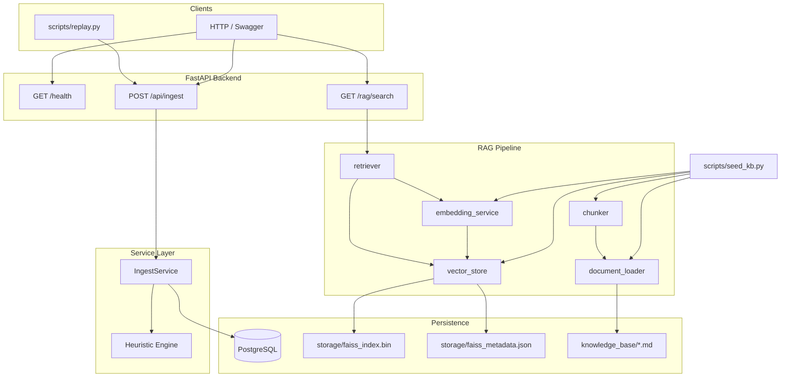
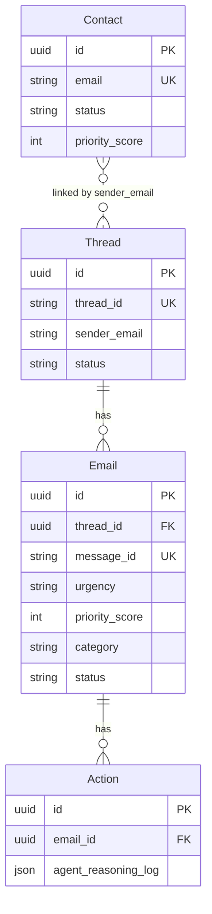

# AI CRM System

Production-grade, AI-powered Customer Relationship Management platform for autonomous email triage, agentic workflows, and real-time business insights.

**Assessment spec:** see [`project.md`](project.md)  
**Dataset:** [`email-data-advanced.json`](email-data-advanced.json) — 60 emails, 30+ threads

---

## Table of Contents

- [Architecture](#architecture)
- [Tech Stack](#tech-stack)
- [Project Structure](#project-structure)
- [Quick Start](#quick-start)
- [Configuration](#configuration)
- [Database](#database)
- [API Reference (Implemented)](#api-reference-implemented)
- [Email Ingestion Pipeline](#email-ingestion-pipeline)
- [Heuristic Triage Engine](#heuristic-triage-engine)
- [RAG Knowledge Pipeline](#rag-knowledge-pipeline)
- [Scripts](#scripts)
- [Knowledge Base](#knowledge-base)
- [Design Decisions](#design-decisions)
- [What's Not Built Yet](#whats-not-built-yet)
- [Continuing Development](#continuing-development)
- [Development Progress Log](#development-progress-log)

---

## Architecture



### Data model (implemented)



> **Note:** `Contact` model exists but is not yet populated during ingestion. `Action` model exists but agent workflows are not implemented.

---

## Tech Stack

| Layer | Technology |
|-------|------------|
| Runtime | Python 3.11+ |
| API | FastAPI, Uvicorn |
| ORM | SQLAlchemy 2.0 |
| Database | PostgreSQL |
| Migrations | Alembic |
| Config | Pydantic Settings, `.env` |
| Embeddings | sentence-transformers (`all-MiniLM-L6-v2`) |
| Vector store | FAISS (`IndexFlatL2`) |
| Chunking | langchain-text-splitters |
| HTTP client | httpx (replay simulator) |

---

## Project Structure

```
Ai_crm_system/
├── alembic/                    # DB migrations
├── app/
│   ├── api/
│   │   ├── deps.py             # FastAPI dependencies (DB session, services)
│   │   ├── rag.py              # GET /rag/search
│   │   └── router.py           # POST /api/ingest
│   ├── core/
│   │   └── config.py           # Pydantic settings
│   ├── db/
│   │   └── database.py         # Engine, SessionLocal, get_db
│   ├── models/                 # SQLAlchemy ORM models
│   │   ├── contact.py
│   │   ├── thread.py
│   │   ├── email.py
│   │   ├── action.py
│   │   └── enums.py
│   ├── rag/
│   │   ├── document_loader.py  # Load knowledge_base/*.md
│   │   ├── chunker.py          # RecursiveCharacterTextSplitter
│   │   ├── embedding_service.py
│   │   ├── vector_store.py     # FAISS persistence
│   │   └── retriever.py        # Query → top-3 chunks
│   ├── schemas/                # Pydantic request/response models
│   ├── scripts/
│   │   ├── replay.py           # Email replay simulator
│   │   └── seed_kb.py          # Build FAISS index
│   ├── services/
│   │   ├── heuristics.py       # Layer 1 triage (no LLM)
│   │   ├── ingest_service.py
│   │   ├── thread_context_service.py  # LLM-ready thread history
│   │   ├── llm_classifier.py     # Gemini Layer 2 classification
│   │   └── exceptions.py
│   └── main.py                 # FastAPI app entry point
├── knowledge_base/             # Enterprise policy documents (6 files)
├── scripts/                    # CLI entry points (thin wrappers)
│   ├── replay.py
│   └── seed_kb.py
├── storage/                    # Generated at runtime (gitignore recommended)
│   ├── faiss_index.bin
│   └── faiss_metadata.json
├── email-data-advanced.json
├── requirements.txt
├── alembic.ini
├── .env.example
└── project.md                  # Full assessment requirements
```

---

## Quick Start

### 1. Prerequisites

- Python 3.11+
- PostgreSQL running locally
- ~2 GB disk for `torch` + embedding model (first run downloads from Hugging Face)

### 2. Install

```powershell
cd Ai_crm_system
python -m venv .venv
.venv\Scripts\Activate.ps1
pip install -r requirements.txt
```

### 3. Configure environment

```powershell
copy .env.example .env
# Edit .env with your PostgreSQL credentials
```

### 4. Database setup

```powershell
# Create database (psql or pgAdmin)
# CREATE DATABASE crm_agent;

alembic upgrade head
```

### 5. Seed knowledge base (required for RAG)

```powershell
python scripts/seed_kb.py
```

### 6. Start API

```powershell
uvicorn app.main:app --reload --port 8000
```

Swagger UI: http://localhost:8000/docs

### 7. Replay test emails (optional)

```powershell
# In another terminal, with API running
python scripts/replay.py --speed 1
```

---

## Configuration

Environment variables (see [`.env.example`](.env.example)):

| Variable | Default | Description |
|----------|---------|-------------|
| `POSTGRES_USER` | `postgres` | DB user |
| `POSTGRES_PASSWORD` | `postgres` | DB password |
| `POSTGRES_HOST` | `localhost` | DB host |
| `POSTGRES_PORT` | `5432` | DB port |
| `POSTGRES_DB` | `ai_crm` | DB name |
| `DATABASE_URL` | — | Optional override for full connection string |
| `ENVIRONMENT` | `development` | `development` / `staging` / `production` |
| `DEBUG` | `false` | FastAPI debug mode |
| `GEMINI_API_KEY` | — | Google Gemini API key (required for LLM classifier) |
| `GEMINI_MODEL` | `gemini-2.5-flash` | Gemini model ID |
| `CLASSIFICATION_RAG_TOP_K` | `1` | RAG chunks sent to classifier (was 3) |
| `CLASSIFICATION_MAX_THREAD_MESSAGES` | `2` | Prior thread messages in prompt |
| `CLASSIFICATION_MAX_THREAD_BODY_CHARS` | `400` | Max chars per prior message body |
| `CLASSIFICATION_MAX_EMAIL_BODY_CHARS` | `1500` | Max chars for current email body |
| `CLASSIFICATION_MAX_RAG_CHUNK_CHARS` | `350` | Max chars per RAG chunk |

---

## Database

### Models

| Table | Purpose |
|-------|---------|
| `contacts` | CRM contact profiles (VIP, churn risk, account value) |
| `threads` | Conversation threads (external `thread_id` from dataset) |
| `emails` | Individual messages with triage fields |
| `actions` | Agent actions and reasoning logs (schema only, unused) |

### Migrations

| Revision | Description |
|----------|-------------|
| `bd19c5174ec7` | Core tables: contacts, threads, emails, actions |
| `bc35f2ecace3` | Empty placeholder migration |
| `4a4ebbc056da` | Add `emails.priority_score` column + index |

```powershell
alembic revision --autogenerate -m "describe change"
alembic upgrade head
```

Models auto-register via `app/models/__init__.py` → `load_models()`.

---

## API Reference (Implemented)

| Method | Endpoint | Status | Description |
|--------|----------|--------|-------------|
| `GET` | `/health` | ✅ | Liveness + DB connectivity check |
| `POST` | `/api/ingest` | ✅ | Ingest email with heuristic triage |
| `GET` | `/rag/search?q=` | ✅ | Search knowledge base, top 3 chunks |
| `POST` | `/api/classify/{email_id}` | ✅ | Classification pipeline — classify + save to DB |
| `POST` | `/test/classify/{email_id}` | ✅ | Classify only (test, no DB write) |

### `POST /api/ingest`

**Request:**
```json
{
  "message_id": "msg_001",
  "thread_id": "thread_alice_pricing",
  "sender": "alice.smith@greenlight-npo.org",
  "subject": "Question about pricing",
  "body": "Do you offer nonprofit discounts?",
  "timestamp": "2023-10-01T09:00:00Z"
}
```

**Response `202`:**
```json
{ "job_id": "<email-uuid>", "status": "accepted" }
```

**Errors:**
- `409` — duplicate `message_id`
- `422` — validation (empty subject/body, missing fields)

### `GET /rag/search?q=refund`

**Response `200`:**
```json
[
  {
    "source_doc": "refund_policy.md",
    "similarity_score": 0.52,
    "chunk_text": "..."
  }
]
```

**Errors:**
- `503` — FAISS index not built (run `seed_kb.py`)
- `422` — empty query

### Error envelope (implemented endpoints)

```json
{
  "detail": {
    "error_code": "DUPLICATE_MESSAGE_ID",
    "message": "Human-readable message",
    "details": {}
  }
}
```

---

## Email Ingestion Pipeline

**Flow:** validate → heuristic triage → store email → return `job_id` → background classification

```
POST /api/ingest
  → Duplicate check (message_id)
  → triage_email(sender, subject, body)          # Layer 1
  → Find or create Thread by thread_id string
  → Create Email record + commit
  → Return { job_id: email.id, status: "accepted" }  # immediate 202
  → BackgroundTasks: run_post_ingest_classification(job_id)
       → Skip if spam / internal / Ignored
       → Set status Processing
       → RAG + Gemini classification              # Layer 2
       → Save category, urgency, confidence, requires_human, sentiment_score
       → Set status Received (preserves Escalated / Ignored)
```

**Files:**
- `app/api/router.py` — route handler
- `app/services/ingest_service.py` — business logic
- `app/schemas/email.py` — `EmailIn`, `EmailResponse`

**Validation rules:**
- All fields required
- Empty `subject` rejected
- Empty or whitespace-only `body` rejected
- Duplicate `message_id` → `409`

**Thread linking:**
- `Thread.thread_id` = external ID from dataset (e.g. `thread_alice_pricing`)
- `Email.thread_id` = FK to `Thread.id` (UUID)
- `last_updated_at` updated when newer email arrives

---

## Heuristic Triage Engine

**File:** `app/services/heuristics.py`  
**Runs synchronously on ingest — no LLM calls.**

### Detection rules

| Signal | Keywords / rules |
|--------|------------------|
| Spam | `nigerian prince`, `seo services`, `earn money fast` |
| Security | `suspicious login`, `breach`, `ransomware` |
| Internal | Sender domain `internal.com` or `mycompany.com` |
| Critical urgency | `p0`, `ransomware`, `cease and desist`, `breach`, `suspicious login` |
| High urgency | `urgent`, `legal` |

### Priority scores (stored in `Email.priority_score`)

| Signal | Score |
|--------|-------|
| Ransomware | 100 |
| P0 | 80 |
| Security (non-ransomware) | 80 |
| Legal / cease and desist | 50 |
| Urgent | 30 |
| Refund | 10 |
| Spam | 5 |
| Default | 0 |

### Ingest side-effects

| Condition | `category` | `status` | `urgency` |
|-----------|------------|----------|-----------|
| Spam | `Spam` | `Ignored` | from heuristic |
| Security | — | `Escalated` | `Critical` |
| Default | — | `Received` | from heuristic |

---

## RAG Knowledge Pipeline

### Components

| Module | Role |
|--------|------|
| `document_loader.py` | Load 6 markdown files from `knowledge_base/` |
| `chunker.py` | Split into 500-char chunks, 50-char overlap |
| `embedding_service.py` | `all-MiniLM-L6-v2`, L2-normalized, singleton |
| `vector_store.py` | FAISS `IndexFlatL2`, persist to `storage/` |
| `retriever.py` | Embed query → search → top 3 chunks |

### Build index

```powershell
python scripts/seed_kb.py
```

Output: 136 chunks across 6 documents → `storage/faiss_index.bin` + `storage/faiss_metadata.json`

### Programmatic usage

```python
from app.rag.retriever import retrieve

chunks = retrieve("I want a refund")
# [{"source_doc": "refund_policy.md", "chunk_text": "...", "similarity_score": 0.52}, ...]
```

### RAG design notes

- **Chunk size:** 500 characters (not tokens) — aligns with project 300–500 token target approximately
- **Index type:** `IndexFlatL2` on L2-normalized vectors; similarity derived as `1 - distance/2`
- **Model:** Local `all-MiniLM-L6-v2` (384-dim) — no API cost, runs on CPU
- **Not yet wired into ingest/LLM** — RAG is standalone; classification agent still TODO

---

## Scripts

| Script | Command | Purpose |
|--------|---------|---------|
| Replay simulator | `python scripts/replay.py --speed 1` | POST all 60 dataset emails to `/api/ingest` |
| KB seeder | `python scripts/seed_kb.py` | Build FAISS index from knowledge base |

**Replay options:**
```powershell
python scripts/replay.py --speed 0          # max speed
python scripts/replay.py --base-url http://localhost:8001
python scripts/replay.py --data-file email-data-advanced.json
```

---

## Knowledge Base

Fictional enterprise SaaS: **FlowStack**

| File | Contents |
|------|----------|
| `pricing_policy.md` | Tiers, 30% nonprofit discount, pro-rata billing |
| `sla_policy.md` | 99.9% uptime, P0 response times, credit formula, 24h RCA |
| `refund_policy.md` | 14-day window, credits vs refunds, retention playbook |
| `api_docs.md` | Rate limits, v1 deprecation, v2 breaking changes |
| `compliance_faq.md` | HIPAA BAA, GDPR DPA, SOC 2, data residency |
| `escalation_matrix.md` | Legal, security, PR crisis, GDPR, VIP routing |

---

## Design Decisions

| Decision | Rationale |
|----------|-----------|
| Sync SQLAlchemy (not async) | Simpler Alembic integration; DB is bottleneck not CPU for current scale |
| `job_id` = email UUID | Reuses existing PK; `GET /api/status/{job_id}` can query email directly |
| Heuristics before DB write | Sub-10ms triage per spec; avoids storing then re-processing |
| FAISS on disk (not pgvector) | Zero extra infra; sufficient for 136 chunks; portable index file |
| Local embeddings | No OpenAI dependency for RAG; assessment allows any embedding model |
| `Thread.thread_id` vs `Thread.id` | External string ID from dataset vs internal UUID FK — avoids string FKs |
| Spam checked before security | Prevents spam content from triggering security escalation |

---

## What's Not Built Yet

From [`project.md`](project.md) — prioritized for next work:

### Backend API (not implemented)

- [ ] `GET /api/status/{job_id}`
- [ ] `GET /dashboard/stats`
- [ ] `GET /threads/{contact_email}`
- [ ] `POST /respond/{email_id}`
- [ ] `PATCH /drafts/{id}`, `POST /drafts/{id}/approve`
- [ ] `GET /analytics/sentiment-trend`
- [ ] `GET /analytics/category-breakdown`
- [ ] `GET /intelligence/reputation`
- [ ] `POST /agent/dry-run/{email_id}`
- [ ] `GET /audit/{entity_type}/{entity_id}`
- [ ] `GET /contacts/{email}`, `PATCH /contacts/{email}/status`

### Intelligence layers (not implemented)

- [ ] **Layer 2 — LLM classification** (category, sentiment, confidence, entities)
- [ ] **Layer 3 — Sentiment trend tracking**
- [ ] **Autonomous agent** (tools, reasoning loop, dry-run mode)
- [ ] **Live web intelligence** (scraping G2/Trustpilot, etc.)

### Data / infra (not implemented)

- [ ] `knowledge_chunks` DB table (vectors currently file-based only)
- [ ] `web_intelligence_cache` table
- [ ] `audit_log` table
- [ ] Contact auto-creation on ingest
- [ ] Background job queue for async processing

### Frontend (not implemented)

- [ ] Mission Control Inbox
- [ ] Thread Workspace
- [ ] Analytics Dashboard

### Deliverables (not implemented)

- [ ] Architecture diagram (in README — mermaid above is a start)
- [ ] Screen recording
- [ ] ER diagram image

---

## Continuing Development

### Thread context service

**File:** `app/services/thread_context_service.py`

```python
from app.db.database import SessionLocal
from app.services.thread_context_service import ThreadContextService

with SessionLocal() as db:
    context = ThreadContextService(db).get_thread_context("thread_alice_pricing")
```

**Output format (LLM-ready):**
```
=== Email Thread: thread_alice_pricing ===
Total messages: 2

--- Message 1 ---
Timestamp: 2023-10-01T09:00:00+00:00
From: alice.smith@greenlight-npo.org
Subject: Question about pricing
Body:
Hi, I was looking at your enterprise plan...

--- Message 2 ---
...
```

Raises `ThreadNotFoundError` if `thread_id` does not exist.

### LLM classifier (Layer 2)

**File:** `app/services/llm_classifier.py`

```python
from app.services.llm_classifier import classify_email
from app.services.thread_context_service import ThreadContextService
from app.rag.retriever import retrieve

thread_history = ThreadContextService(db).get_thread_context("thread_karen_refund")
rag_chunks = retrieve(f"{subject} {body}")

result = classify_email(
    current_email={"sender": "...", "subject": "...", "body": "..."},
    thread_history=thread_history,
    rag_chunks=rag_chunks,
)
# result is ClassificationResult (category, sentiment, confidence, ...)
```

- Model: `gemini-2.5-flash` (configurable via `GEMINI_MODEL`)
- Validates response with `ClassificationResult`; retries once on JSON/validation failure
- Does **not** persist to database yet

**Classification pipeline (saves to DB):**
```bash
curl -X POST http://localhost:8000/api/classify/<email-uuid>
```

Updates `category`, `urgency`, `confidence`, `requires_human`, `sentiment_score` on the email row.

**Test endpoint (no save):**
```bash
curl -X POST http://localhost:8000/test/classify/<email-uuid>
```

### Recommended next steps

1. **Wire classifier into ingest** — after heuristics, for non-spam/non-internal emails
2. **Persist classification** — update `Email` fields + `raw_entities` from result
3. **`GET /api/status/{job_id}`** — return processing + classification status
4. **Contact upsert on ingest** — create/update `Contact` from sender email
5. **Thread API** — `GET /threads/{contact_email}` with emails + actions
6. **Agent service** — implement tools from `project.md` Component 4

### Patterns to follow

- **Router** → `app/api/` with dependency injection via `app/api/deps.py`
- **Business logic** → `app/services/`
- **Pydantic schemas** → `app/schemas/`
- **ORM models** → `app/models/` + Alembic migration
- **Error envelope** → `{ error_code, message, details }` in `HTTPException(detail=...)`

### Testing locally

```powershell
# Health
curl http://localhost:8000/health

# Ingest
curl -X POST http://localhost:8000/api/ingest -H "Content-Type: application/json" -d "{\"message_id\":\"test_001\",\"thread_id\":\"thread_test\",\"sender\":\"a@b.com\",\"subject\":\"Hello\",\"body\":\"Test body\",\"timestamp\":\"2023-10-01T09:00:00Z\"}"

# RAG
curl "http://localhost:8000/rag/search?q=refund%20policy"
```

### Adding a new model

```powershell
# 1. Create app/models/your_model.py inheriting Base from app/db/database.py
# 2. Import in app/models/__init__.py (or rely on load_models())
# 3. Generate migration
alembic revision --autogenerate -m "add your_model"
alembic upgrade head
```

---

## Development Progress Log

> **Update this section after each development session** so the next person or agent can pick up where you left off.

### Session 1 — Foundation (Backend scaffold)

- [x] FastAPI app with Pydantic Settings, SQLAlchemy 2.0, PostgreSQL, Alembic
- [x] `GET /health` with DB connectivity check
- [x] Project structure: `app/core`, `app/db`, `app/main.py`
- [x] `requirements.txt`, `.env.example`

### Session 2 — Data layer

- [x] SQLAlchemy models: `Contact`, `Thread`, `Email`, `Action`
- [x] Enums: `ContactStatus`, `ThreadStatus`, `EmailStatus`
- [x] Alembic migrations with auto model discovery (`load_models()`)
- [x] Relationships: Thread ↔ Email ↔ Action

### Session 3 — Email ingestion

- [x] `POST /api/ingest` with Pydantic validation
- [x] `IngestService` — duplicate detection, thread linking, email storage
- [x] Email replay simulator (`scripts/replay.py`)
- [x] Error envelopes for 409/422

### Session 4 — Heuristic triage

- [x] `app/services/heuristics.py` — spam, security, internal, urgency detection
- [x] Integrated into ingest pipeline (before DB write)
- [x] `Email.priority_score` column + migration
- [x] Priority scoring: spam=5, refund=10, urgent=30, legal=50, p0=80, ransomware=100

### Session 5 — RAG pipeline

- [x] Enterprise knowledge base (6 markdown documents in `knowledge_base/`)
- [x] `document_loader.py` — load all KB files
- [x] `chunker.py` — RecursiveCharacterTextSplitter (500/50)
- [x] `embedding_service.py` — all-MiniLM-L6-v2 singleton
- [x] `vector_store.py` — FAISS IndexFlatL2 + persistence
- [x] `retriever.py` — query → top 3 chunks
- [x] `scripts/seed_kb.py` — build index (136 chunks)
- [x] `GET /rag/search?q=` endpoint
- [x] RAG dependencies in `requirements.txt`

### Session 6 — Thread context service

- [x] `ThreadContextService` — format chronological thread history for LLM prompts
- [x] `ThreadNotFoundError` exception
- [x] `get_thread_context_service()` dependency in `app/api/deps.py`
- [x] Queries by external `thread_id` string (e.g. `thread_alice_pricing`)

### Session 7 — LLM classification (Layer 2)

- [x] `ClassificationResult` Pydantic schema (`app/schemas/classification.py`)
- [x] `LLMClassifier` — Gemini 2.5 Flash via `google-genai`
- [x] Prompt: thread history + current email + RAG chunks
- [x] JSON schema validation with Pydantic; retry once on failure
- [x] `GEMINI_API_KEY` / `GEMINI_MODEL` in settings
- [x] `ClassificationService.run_classification_pipeline()` — classify + save to `emails`
- [x] `POST /api/classify/{email_id}` — production pipeline endpoint
- [x] `POST /test/classify/{email_id}` — test endpoint (no DB persistence)
- [x] Background classification on `POST /api/ingest` via `BackgroundTasks`

### Current state summary

| Component | Status |
|-----------|--------|
| FastAPI backend | ✅ Running |
| PostgreSQL + migrations | ✅ Applied |
| Email ingestion | ✅ Complete |
| Heuristic triage (Layer 1) | ✅ Complete |
| Email replay simulator | ✅ Complete |
| RAG pipeline | ✅ Complete (not wired to ingest/LLM) |
| Thread context service | ✅ Complete |
| LLM classification (Layer 2) | ✅ Pipeline + persist + background ingest |
| ClassificationResult schema | ✅ Complete |
| Autonomous agent | ❌ Not started |
| Web intelligence | ❌ Not started |
| Dashboard APIs | ❌ Not started |
| Frontend | ❌ Not started |

### Known issues / notes

- First `seed_kb.py` or RAG query run downloads ~90 MB embedding model from Hugging Face
- `bc35f2ecace3` migration is an empty placeholder — safe to ignore
- `Contact` and `Action` tables exist but have no service layer yet
- RAG index must be rebuilt after KB document changes: `python scripts/seed_kb.py`
- Consider adding `storage/` to `.gitignore` (contains generated binaries)

---

*Last updated: 2026-06-10 (Session 7 — LLM classifier + test endpoint)*
